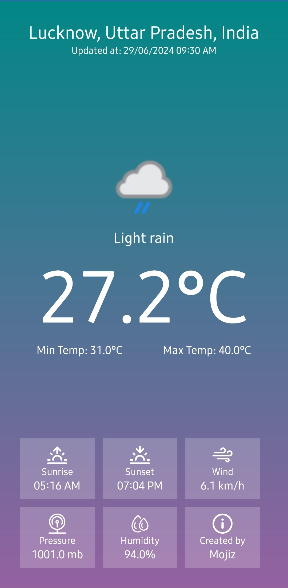

# Weather App

- A simple android weather application that provides current weather conditions for a given location.
- It is built entirely with Kotlin.
- The user interface (UI) of this app is created using XML layouts.



## Features

- **Current Weather:** Get real-time weather data, including temperature, pressure, humidity, and wind speed.
- **Minimalistic Design:** The app features a clean and uncomplicated design approach.
- **Search by Location:** Enter a city name or coordinates to retrieve weather information. [*This feature will be implemented soon!*]

## Installation

1. Clone this repository:
   ```bash
   git clone https://github.com/SyedRizvi786092/weather-app.git
   ```

2. Open the project in Android Studio.

3. Build and run the app on an emulator or physical device.

## Usage

1. Launch the app.
2. Enter a city name or coordinates in the search bar. [*coming soon!*]
3. View the current weather details.

## Contributing

Contributions are welcome! If you'd like to contribute to this project, please follow these steps:

1. Fork the repository.
2. Create a new branch.
3. Make your changes.
4. Submit a pull request.

## Acknowledgments

- Weather data provided by [Weather API](https://www.weatherapi.com/).
